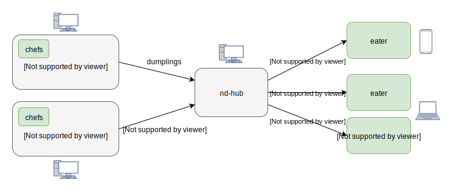

# netdumplings

A framework for distributed network packet sniffing and processing.

See the [documentation](https://netdumplings.readthedocs.org) for more details,
and the [netmomo](https://github.com/mjoblin/netmomo) and
[packscape](https://github.com/mjoblin/packscape) sample Web applications
(dumpling eaters) which use netdumplings as their back-end. Python 3.5 or
higher is required.

## Installation

```
pip install netdumplings
```

## Distributed packet sniffing?

netdumplings allows you to run multiple packet sniffers on any number of hosts.
Those sniffers -- called **dumpling kitchens** -- pass any sniffed network
packets to your Python code for processing. Your Python code is implemented as
classes called **dumpling chefs** which use the network packets to generate
**dumplings**. Dumpling contents are entirely up to you but they'll usually
describe the information contained in the sniffed network packets.

The dumplings created by the dumpling chefs are sent from the dumpling kitchens
to a single **dumpling hub**, which forwards them on to any connected
**dumpling eaters** for display or for any other sort of processing or
visualization.

The **kitchens**, **chefs**, **dumplings**, **hub**, and **eaters**, are shown
below. You write the bits in green (the chefs and eaters) and netdumplings
does the rest:



Dumplings are sent between the kitchens, hub, and eaters, over WebSockets.

## What does a dumpling look like?

Dumplings are just JSON data. The following dumpling was created by a chef
which makes a dumpling for every DNS lookup.

```json
{
    "metadata": {
        "chef": "DNSLookupChef",
        "creation_time": 1515990765.925951,
        "driver": "packet",
        "kitchen": "default_kitchen"

    },
    "payload": {
        "lookup": {
            "hostname": "myspace.com",
            "when": 1515990721.147
        }
    }
}
```

The `"payload"` section is generated by the dumpling chef and the `"metadata"`
section is created automatically when the dumpling is sent to the hub by the
kitchen.

## Example dumpling chef

The following dumpling chef creates a dumpling for every DNS lookup (see the
example dumpling above).

```python
import time
import netdumplings

class DNSLookupChef(netdumplings.DumplingChef):
    def packet_handler(self, packet):
        # The incoming packet is a scapy packet object.
        # https://scapy.readthedocs.io

        # Ignore packets that we don't care about.
        if not packet.haslayer('DNS'):
            return

        # Determine the name of the host that was looked up.
        dns_query = packet.getlayer('DNS')
        query = dns_query.fields['qd']
        hostname = query.qname.decode('utf-8')

        # Generate a dumpling payload from the DNS lookup.
        dumpling_payload = {
            'lookup': {
                'hostname': hostname,
                'when': time.time(),
            }
        }

        # The handler is returning a dict, which will be automatically
        # converted into a dumpling and sent to nd-hub, which will then
        # forward it on to all the eaters.
        return dumpling_payload
```

## Example dumpling eater

The following eater prints the payload of every dumpling sent from `nd-hub`.

```python
import json
import netdumplings

class PrinterEater(netdumplings.DumplingEater):
    async def on_connect(self, hub_uri, websocket):
        print(f'Connected to nd-hub at {hub_uri}')
        print('Waiting for dumplings...\n')

    async def on_dumpling(self, dumpling):
        # The given dumpling is a netdumplings.Dumpling instance.
        dumpling_printable = json.dumps(dumpling.payload, indent=4)
        print(f'{dumpling_printable}\n')


def dumpling_printer():
    eater = PrinterEater()
    eater.run()


if __name__ == '__main__':
    dumpling_printer()
```

## More information

See the [documentation](https://netdumplings.readthedocs.org) for more details.
