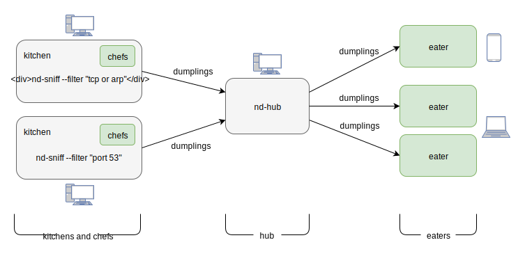

Overview
========

netdumplings allows you to run multiple packet sniffers on any number of hosts.
Those sniffers -- called **dumpling kitchens** -- pass any sniffed network
packets to your Python code for processing. Your Python code is implemented as
classes called **dumpling chefs** which use the network packets to generate
**dumplings**. Dumpling contents are entirely up to you but they'll usually
describe the information contained in the sniffed network packets.

The dumplings created by the dumpling chefs are sent from the dumpling kitchens
to a single **dumpling hub**, which forwards them on to any connected
**dumpling eaters** for display or for any other sort of processing or
visualization.

Dumplings are sent between the sniffer kitchens, hub, and eaters, over
WebSockets.

Dumpling chefs are written in Python and are registered with the sniffer
kitchens. Dumpling eaters can be written in any language but netdumplings
provides a convenience class for writing them in Python.

Dumpling sniffer kitchens are started with the ``nd-sniff`` commandline tool,
and the dumpling hub is started with the ``nd-hub`` commandline tool.

The result looks something like this:

You write the bits in green (the dumpling chefs and the dumpling eaters) and
netdumplings provides the rest. Also, even though the above shows everything
running on different hosts, you can run everything on the same host if that
better suits your needs.

What does a dumpling look like?
-------------------------------

Dumplings are just JSON data. Following is an example dumpling created from the
work of a chef which counts packets by protocol: ::

    {
        "metadata": {
            "chef": "PacketCountChef",
            "creation_time": 1515990765.925951,
            "driver": "interval",
            "kitchen": "default_kitchen"

        },
        "payload": {
            "packet_counts": {
                "Ethernet": 1426745,
                "IP": 1423352,
                "TCP": 12382,
                "UDP": 1413268
            }
        }
    }

The ``payload`` section is generated by the dumpling chef, and the ``metadata``
section is created automatically when the dumpling is sent to the dumpling hub.

What's in the box?
------------------

netdumplings comes with:

* The packet sniffer kitchen ``nd-sniff``
* The dumpling hub ``nd-hub``
* Sample dumpling chefs in the ``netdumplings.dumplingchefs`` module
* Sample dumpling eaters ``nd-print``, ``nd-hubdetails``, and ``nd-hubstatus``
* Classes to help you write your own chefs and eaters

There's enough in the installation package to get started without writing any
code, but to get the most out of netdumplings you'll write your own dumpling
chefs and dumpling eaters.
