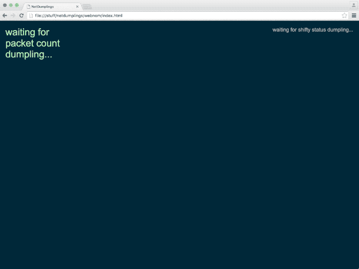

.. automodule:: netdumplings

Quickstart
==========

To try netdumplings you don't need to write any of your own code. You can use
the sample dumpling chefs and dumpling eaters instead, which is what we'll do
in this quickstart.

In this quickstart you'll:

1. Start the dumpling hub ``nd-hub``
2. Start a sniffer kitchen ``nd-sniff`` (to sniff the network and create
   dumplings)
3. Start a dumpling eater ``nd-print`` (to display the dumplings)

.. warning:: You may need to run ``nd-sniff`` as root (or as an Adminstrator on
  Windows), especially if you see errors from ``nd-sniff`` that you don't see
  with the other CLI tools. If you do this and are using a virtualenv, then
  remember to source your virtualenv after you become root.

1. Dumpling hub
---------------

First start the dumpling hub: ::

   $ nd-hub

You should see something like this: ::

    2018-01-20T22:40:27.416 INFO Dumpling hub initiated; waiting for connections
    2018-01-20T22:40:27.417 INFO Dumplings in: ws://localhost:11347  out: ws://localhost:11348

The hub is now waiting for WebSocket connections from one or more kitchens
(to receive dumplings from) or eaters (to send dumplings to).

2. Sniffer kitchen
------------------

Now open another terminal and start a sniffer kitchen (**you may need to do this
as root, depending on your system**): ::

   $ nd-sniff

You should see something like this: ::

    2018-01-20T22:41:15.991 INFO default_kitchen: Starting network sniffer process
    2018-01-20T22:41:15.992 INFO default_kitchen: Interface: en0
    2018-01-20T22:41:15.992 INFO default_kitchen: Starting dumpling emitter process
    2018-01-20T22:41:15.993 INFO default_kitchen: Requested chefs: all
    2018-01-20T22:41:15.993 INFO default_kitchen: Chef modules: netdumplings.dumplingchefs
    2018-01-20T22:41:15.993 INFO default_kitchen: Filter: tcp or udp or arp
    2018-01-20T22:41:15.993 INFO default_kitchen: Chef poke interval (secs): 5.0
    2018-01-20T22:41:15.993 INFO default_kitchen: Registering netdumplings.dumplingchefs.ARPChef with kitchen
    2018-01-20T22:41:15.994 INFO default_kitchen: Registering netdumplings.dumplingchefs.DNSLookupChef with kitchen
    2018-01-20T22:41:15.994 INFO default_kitchen: Registering netdumplings.dumplingchefs.PacketCountChef with kitchen
    2018-01-20T22:41:15.994 INFO default_kitchen: Starting interval poker thread
    2018-01-20T22:41:15.994 INFO default_kitchen: Connecting to the dumpling hub at ws://localhost:11347
    2018-01-20T22:41:15.995 INFO default_kitchen: Starting sniffer thread

The sniffer kitchen will default to passing all sniffed packets to the dumpling
chefs defined in the ``netdumplings.dumplingchefs`` module. This includes
`ARPChef`_ (which reports ARP traffic), `DNSLookupChef`_ (which reports DNS
lookups), and `PacketCountChef`_ (which counts packets by protocol).

The dumplings created by the chefs are automatically sent to the dumpling hub,
which then forwards them on to any connected eaters.

You may need to specify an interface when starting the dumpling kitchen: ::

   $ nd-sniff --interface en0

3. Dumpling eater
-----------------

Now open a third terminal and start a sample eater. This eater will display all
the dumplings generated by the dumpling chefs registered to the kitchen. ::

   $ nd-print

You should see something like this: ::

    Connected to nd-hub at ws://localhost:11348
    Waiting for dumplings...

    2018-01-20T14:42:11.040829 [interval] PacketCountChef from default_kitchen

    {
        "packet_counts": {
            "ARP": 4,
            "Ethernet": 7052,
            "IP": 7048,
            "Raw": 7046,
            "TCP": 6,
            "UDP": 7042
        }
    }

.. Note::

   You've now seen netdumplings at work. The network was sniffed by the
   **kitchen** (``nd-sniff``), which passed all the sniffed packets to the
   registered **chefs**. Those chefs produced **dumplings** which were
   automatically sent to the **hub** (``nd-hub``) which forwarded them on to
   the **eater** ``nd-print``).

Additional dumpling eaters
--------------------------

netdumplings comes with two other dumpling eaters which can be used to monitor
``nd-hub``, called ``nd-hubstatus`` and ``nd-hubdetails``.

``nd-hubstatus`` continually prints summary status information from
``nd-hub``: ::

    $ nd-hubstatus

    nd-hub status from ws://localhost:11348
    2018-01-20 14:44:52  uptime: 00:04:25  dumplings in: 107  out: 92  kitchens: 1  eaters: 1

``nd-hubdetails`` displays the contents of a single system status dumpling: ::

    $ nd-hubdetails

    Connected to nd-hub at ws://localhost:11348
    Waiting for a SystemStatus dumpling...

    {
        "dumpling_eater_count": 1,
        "dumpling_eaters": [
            {
                "info_from_eater": {
                    "eater_name": "detailseater"
                },
                "info_from_hub": {
                    "host": "::1",
                    "port": 60807
                }
            }
        ],
        "dumpling_kitchen_count": 1,
        "dumpling_kitchens": [
            {
                "info_from_hub": {
                    "host": "::1",
                    "port": 60786
                },
                "info_from_kitchen": {
                    "chefs": [
                        "netdumplings.dumplingchefs.ARPChef",
                        "netdumplings.dumplingchefs.DNSLookupChef",
                        "netdumplings.dumplingchefs.PacketCountChef"
                    ],
                    "filter": "tcp or udp or arp",
                    "interface": "en0",
                    "kitchen_name": "default_kitchen",
                    "poke_interval": 5.0
                }
            }
        ],
        "server_uptime": 275.232823,
        "total_dumplings_in": 111,
        "total_dumplings_out": 95
    }

A Web browser dumpling eater
````````````````````````````

There's also a small Web browser dumpling eater in the netdumplings source
repository. You can run it by copying the `source code from GitHub`_ and
loading it into a web browser. Or you can clone the entire netdumplings
repository and find the web eater in the ``netdumplings/webnom/`` directory: ::

    git clone https://github.com/mjoblin/netdumplings.git

It looks something like this:



Writing your own chefs and eaters
---------------------------------

This quickstart showed you how to use netdumplings with the provided dumpling
chefs and eaters. However, to get the most use out of netdumplings you'll be
writing your own chefs in Python (by subclassing :class:`DumplingChef`) which
you register with one or more running instances of ``nd-sniff``.

You'll also write your own eaters (perhaps using the :class:`DumplingEater`
helper class). Dumpling eaters are just WebSocket clients which receive JSON
dumpling payloads so you can also write them in any other language.

See :ref:`Writing a dumpling chef <writing chef>` and
:ref:`Writing a dumpling eater <writing eater>`.


.. _ARPChef: https://github.com/mjoblin/netdumplings/blob/master/dumplingchefs/arpchef.py
.. _DNSLookupChef: https://github.com/mjoblin/netdumplings/blob/master/dumplingchefs/dnslookupchef.py
.. _PacketCountChef: https://github.com/mjoblin/netdumplings/blob/master/dumplingchefs/packetcountchef.py
.. _source code from GitHub: https://github.com/mjoblin/netdumplings/blob/master/webnom/
