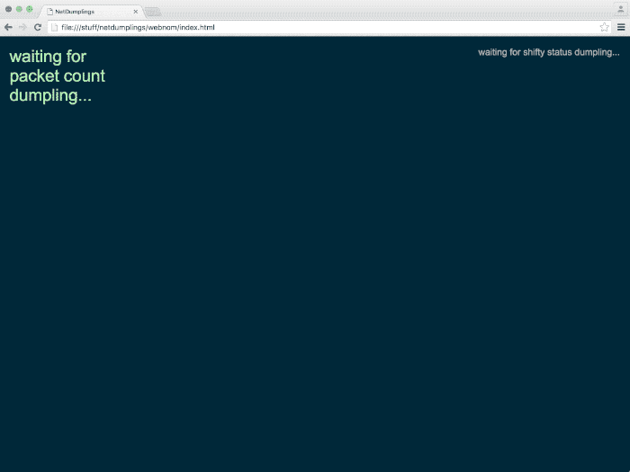

.. _run-it:

.. automodule:: netdumplings

Let's run this thing!
=====================

Let's fire up some of these NetDumplings command-line scripts and see what they
look like.  In this example we're going to see if we can watch some DNS
activity on on your network.  We're going to:

1. Start `nd-shifty` (the dumpling hub) in one terminal window.
#. Start `nd-status` (a DumplingEater) in a second terminal window.

Hopefully we'll then have our `nd-shifty` running like a boss and itching to
start shifting some superior legit network dumplings.  Then we'll:

3. Start `nd-snifty` in a third terminal window to begin sniffing for DNS-related network packets (remember DNS traffic uses port 53).  We'll have `nd-snifty` send those packets to our :ref:`api-dnslookupchef`.
#. Start `nd-printer` (a :class:`DumplingEater`) in a fourth terminal window to print our tasty dumplings to the terminal.
#. Start some more chefs and view some dumplings in a web browser.
#. Bask in all the dumplings.

You read that right -- we'll be needing four (4!) terminal windows for this.
If you've installed NetDumplings in a virtual environment then make sure you're
set to that environment in all your terminals.

When we're all done we should have something that looks like this:

.. image:: ../_static/run_it.svg
   :width: 600
   :align: center

1. Start nd-shifty
------------------

First we start `nd-shifty`, our dumpling hub. ::

    $ nd-shifty

By default `nd-shifty` will receive dumplings on port 11347 and send dumplings
out on port 11348.  You can override those port with the ``--in-port`` and
``--out-port`` arguments.

If that worked you should see something like this: ::

    2016-04-22.22:58:41.238.UTC INFO Dumpling hub initiated; waiting for connections
    2016-04-22.22:58:41.239.UTC INFO Dumplings in: ws://localhost:11347  out: ws://localhost:11348

2. Start nd-status
------------------

`nd-shifty` generates its own SystemStatus dumplings, and since `nd-shifty` is
already running then it should be making those dumplings as we speak!  So let's
see if we can devour them by starting `nd-status` (a DumplingEater) in another
terminal window: ::

    $ nd-status

If that worked you should see something like this: ::

    2016-04-22.22:59:13.777.UTC INFO statusnommer: Running dumpling eater
    2016-04-22.22:59:13.787.UTC INFO statusnommer: Connected to shifty at ws://localhost:11348
    Shifty status from ws://localhost:11348
    2016-04-22 22:59:16  uptime: 00:00:35  dumplings: 0  kitchens: 0  eaters: 1

Note the eater count of 1 -- that's us!

Bonus: run nd-info
^^^^^^^^^^^^^^^^^^

`nd-info` is another dumpling eater which eats SystemStatus dumplings, just
like `nd-status`; but unlike `nd-status` it instead chooses to print the
entire contents of the first dumpling payload it receives and then exits.  If
you run it then you should see something like this: ::

    2016-04-22.22:59:50.228.UTC INFO infonommer: Running dumpling eater
    2016-04-22.22:59:50.236.UTC INFO infonommer: Connected to shifty at ws://localhost:11348
    Connected to nd-shifty at ws://localhost:11348
    Waiting for dumpling from SystemStatusChef...
    SystemStatusChef dumpling:

    {
        "dumpling_eater_count": 2,
        "dumpling_eaters": [
            {
                "info_from_eater": {
                    "eater_name": "infonommer"
                },
                "info_from_shifty": {
                    "host": "::1",
                    "port": 59014
                }
            },
            {
                "info_from_eater": {
                    "eater_name": "infonommer"
                },
                "info_from_shifty": {
                    "host": "::1",
                    "port": 59015
                }
            }
        ],
        "dumpling_kitchen_count": 0,
        "dumpling_kitchens": [],
        "server_uptime": 70.052321,
        "total_dumplings_sent": 7
    }

    2016-04-22.22:59:51.287.UTC INFO infonommer: Done eating dumplings.

There you go -- you just saw your first dumpling payload in its raw JSON form.
Raw JSON; there's nothing like it.  Delicious!

3. Start nd-snifty
------------------

Now that we have our dumpling hub (`nd-shifty`) up and running, let's see about
sniffing some DNS traffic.  We do that by starting `nd-snifty`: ::

    $ nd-snifty --filter "port 53" --chefs DNSLookupChef

.. Important::
   `nd_snifty` is a packet sniffer so it needs to be run as root,
   or the equivalent in your particular environment.

.. Important::
   If you're sniffing a wireless network then you need to ensure that your
   wifi interface is in monitor mode and is listening to the correct channel
   on the correct frequency.  See this `wifi info`_.  That said, on OSX it will
   probably work fine as-is so long as everything is running on the same
   machine and you're sniffing the traffic coming from that same host.

We want to limit our packet sniffing just to port 53 (DNS) which we do with
the ``--filter`` flag.  (You can read more about the `filter syntax here`_).
Also, `nd-snifty` will attempt to use all available chefs by default so we
restrict it to just :ref:`api-dnslookupchef` with the ``--chefs`` flag.

If everything worked then you should see something like this: ::

    2016-04-22.23:01:17.892.UTC INFO default_kitchen: Starting network sniffer process
    2016-04-22.23:01:17.893.UTC INFO default_kitchen: Interface: all
    2016-04-22.23:01:17.893.UTC INFO default_kitchen: Requested chefs: DNSLookupChef
    2016-04-22.23:01:17.893.UTC INFO default_kitchen: Chef modules: netdumplings.dumplingchefs
    2016-04-22.23:01:17.893.UTC INFO default_kitchen: Filter: port 53
    2016-04-22.23:01:17.893.UTC INFO default_kitchen: Chef poke interval (secs): 5
    2016-04-22.23:01:17.893.UTC INFO default_kitchen: Starting dumpling emitter process
    2016-04-22.23:01:17.896.UTC INFO default_kitchen: Connecting to shifty at ws://localhost:11347
    2016-04-22.23:01:17.898.UTC INFO default_kitchen: Registering netdumplings.dumplingchefs.DNSLookupChef with kitchen
    2016-04-22.23:01:17.898.UTC INFO default_kitchen: Starting interval poker thread
    2016-04-22.23:01:17.899.UTC INFO default_kitchen: Starting sniffer thread

And because `nd-snifty` connects to `nd-shifty` (so it can send its delicious
dumplings) you should now see something like this in the terminal where
`nd-shifty` is running: ::

    2016-04-22.23:01:17.908.UTC INFO Received dumpling kitchen connection from default_kitchen at ::1:59018

4. Start nd-printer
-------------------

Hopefully so far so good.  But are we getting any DNS dumplings?  `nd-shifty`
and `nd-snifty` are pretty quiet about that (they get much chattier if you
use ``--log-level DEBUG``).  Let's see if we're getting any dumplings by
running the `nd-printer` dumpling eater: ::

    $ nd-printer --chef DNSLookupChef

If that worked then you should start seeing some sexy raw JSON being printed
to your terminal window.  (You may need to hop to a browser and load a web page
or something, so that some DNS traffic appears on your network).

Note that DNSLookupChef creates two types of dumplings -- both of which will be
printed by `nd-printer`:

 1. The first dumpling type is made every time there's a DNS lookup performed
    on the network.  This dumpling's payload contains the name of the host being
    looked up.
 #. The second dumpling type is made at regular intervals (by default every 5
    seconds).  This dumpling's payload contains a list of all the hosts the
    DNSLookupChef has seen be looked up so far (and how many times per host).

5. Start more chefs and view in a web browser
---------------------------------------------

Now that we have our DNSLookupChef up and running, let's stop our `nd-snifty`
command-line script and restart it with a new filter string and a new chef
list.  (You'll want to keep `nd-shifty` running so don't kill that one).

First go to your terminal window where `nd-snifty` (not `nd-shifty`) is running
and kill the process.  Then restart it like so: ::

   $ nd-snifty --filter "tcp or udp or arp" \
       --chefs ARPChef,DNSLookupChef,PacketCountChef

We've broadened our filter string to ``tcp or udp or arp`` which should result
in us sniffing plenty of packets.  We've also added two new chefs to the
equation: :ref:`api-arpchef` and :ref:`api-packetcountchef`.

Note that every sniffed packet will go to every chef, but the chefs are
written to ignore packets they don't care about.

To view the results in a web browser you'll need to get the example web-based
dumpling eater onto your system.  If you don't already have all the source code
then do this in a terminal: ::

   $ git clone https://github.com/mjoblin/netdumplings.git

Alternatively you can manually download the `web-based dumpling eater source`_
from github.

Then go to a web browser and navigate to
``file:///path/to/netdumplings/webnom/index.html``.  You'll need to replace
``/path/to/netdumplings`` with the directory you cloned (or downloaded) the
source code into on your system.

If everything worked you should see something like this:

What about ARPChef's dumplings?
^^^^^^^^^^^^^^^^^^^^^^^^^^^^^^^

The example web visualizer doesn't display dumplings made by ARPChef, but you
can view those in a terminal (remember to activate your virtualenv if you're
using one): ::

   $ nd-printer --chef ARPChef

To see any dumplings from ARPChef you'll need to have some `ARP traffic`_ on
your network.  You can force that to happen by doing this: ::

   $ python
   >>> from scapy.all import sr1, ARP
   >>> my_ip = '10.0.1.1'
   >>> dst_ip = '10.0.1.100'
   >>> arp_result = sr1(ARP(op=ARP.who_has, psrc=my_ip, pdst=dst_ip))
   >>> arp_result.show()

(You may need to set ``my_ip`` to your IP address and ``dst_ip`` to the IP
address of another known host on your network).

Another way
^^^^^^^^^^^

Instead of restarting our single `nd-snifty` with new ``--filter`` and
``--chefs`` arguments, we could have left the old one running and started a
second `nd-snifty` like this: ::

   $ nd-snifty --kitchen-name "horatio" --filter "tcp or udp or arp" \
       --chefs ARPChef,PacketCountChef

The ``--kitchen-name`` argument gives this `nd-snifty` instance a different
name to help distinguish it from the other one.  It also excludes DNSLookupChef
as that chef is already talking to the other `nd-snifty`.

If we'd done it this way instead then we'd end up with two `nd-snifty`
instances running; both of which would be sending their dumplings to our one
`nd-shifty` instance which would in turn be sending them on to all the `eaters`.

Remember you can have as many `nd-snifty` instances running as you like -- all
with different filter strings and chef lists (if desired); and possibly even
running on different machines on your network.

6. Bask
-------

Go on, you earned it.

.. _web-based dumpling eater source: https://github.com/mjoblin/netdumplings/blob/master/webnom/
.. _ARP traffic: https://en.wikipedia.org/wiki/Address_Resolution_Protocol
.. _filter syntax here: http://www.tcpdump.org/manpages/pcap-filter.7.html
.. _wifi info: https://en.wikipedia.org/wiki/List_of_WLAN_channels

